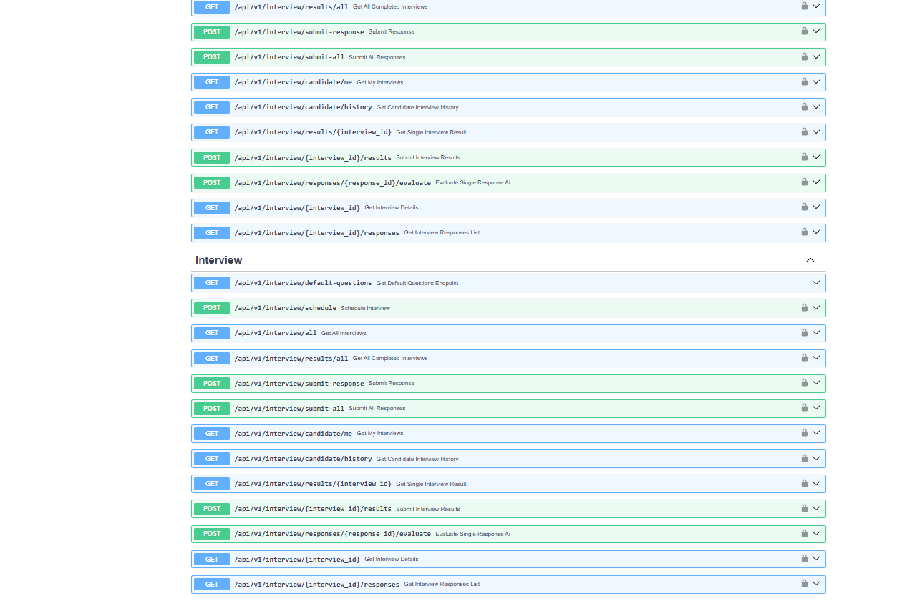

# 🤖 LLM Interviewer Platform

[](https://opensource.org/licenses/MIT)
[](https://www.python.org/downloads/)
[](https://fastapi.tiangolo.com/)

Welcome to the LLM Interviewer Platform! 🎉 This project leverages Large Language Models to conduct automated interviews, analyze candidate responses, and streamline the hiring process.

## ✨ Features

*   **Automated Interviews**: Conduct interviews using AI-powered questions.
*   **Candidate Registration & Management**: Easy onboarding for candidates and HR personnel.
*   **Resume Analysis**: AI-driven insights from candidate resumes.
*   **Real-time Feedback**: (Future Goal) Provide instant feedback and scoring.
*   **Search & Filtering**: Efficiently search and filter candidates and interview data.
*   **Secure Authentication**: Robust authentication for users.
*   **Scalable Architecture**: Built with FastAPI for high performance.

## 📸 Screenshots

Here's a sneak peek of the LLM Interviewer Platform in action:

| Registration                                     | View 1                                       | View 2                                       |
| :-----------------------------------------------: | :-------------------------------------------: | :-------------------------------------------: |
|  |    |  |

| View 3                                       | View 4                                       |
| :-------------------------------------------: | :-------------------------------------------: |
|  |  |

## 🚀 Getting Started

### Prerequisites

*   Python 3.9+
*   MongoDB
*   Poetry (or pip for managing dependencies)
*   An API key for an LLM provider (e.g., Gemini/OpenAI)

### Installation & Setup (Server)

1.  **Clone the repository:**
    ```bash
    git clone https://your-repository-url.git
    cd LLM_interviewer-Copy-Copy-(2)/server
    ```

2.  **Create a virtual environment:**
    ```bash
    python -m venv venv
    source venv/bin/activate  # On Windows use `venv\Scripts\activate`
    ```

3.  **Install dependencies:**
    ```bash
    pip install -r requirements.txt
    # If you have dev requirements:
    # pip install -r requirements-dev.txt
    ```

4.  **Set up environment variables:**
    Create a `.env` file in the `server/` directory by copying `.env.example`:
    ```bash
    cp .env.example .env
    ```
    Update the `.env` file with your MongoDB connection string, LLM API keys, and other configurations.

5.  **Run database migrations/seed data (if applicable):**
    *(Instructions for seeding data if you have scripts like `seed_default_questions.py`)*
    ```bash
    python -m app.db.seed_default_questions # Example, adjust as per your project
    ```

6.  **Run the development server:**
    ```bash
    uvicorn app.main:app --reload --host 0.0.0.0 --port 8000
    ```
    The API will be available at `http://localhost:8000/docs`.

## 🛠️ Tech Stack

*   **Backend**: Python, FastAPI
*   **Database**: MongoDB
*   **LLM Integration**: Gemini (or other LLMs)
*   **Authentication**: JWT
*   **Testing**: Pytest
*   **Deployment**: Docker

## 🐳 Docker

A `Dockerfile` is included in the `server/` directory to build a Docker image for the FastAPI application.

### Building the Docker Image

Navigate to the `server/` directory where the `Dockerfile` is located:

```bash
cd server
docker build -t llm-interviewer-server .
```

### Running the Docker Container

Once the image is built, you can run it as a container:

```bash
docker run -d -p 8000:8000 --env-file .env llm-interviewer-server
```
Make sure your `server/.env` file is correctly configured, as it will be used by the container. The application will be accessible at `http://localhost:8000`.

### Using Docker Compose

A `docker-compose.yml` file is provided at the root of the project for easier management, especially during development.

1.  **Ensure your `server/.env` file is configured.**
2.  **Build and run the services:**
    From the project root directory (where `docker-compose.yml` is located):
    ```bash
    docker-compose up --build
    ```
    To run in detached mode:
    ```bash
    docker-compose up --build -d
    ```
3.  **To stop the services:**
    ```bash
    docker-compose down
    ```
The server application will be accessible at `http://localhost:8000`. The `docker-compose.yml` is configured to mount the `server/app` directory for live reloading during development.

## 🤝 Contributing

Contributions are welcome! If you'd like to contribute, please follow these steps:

1.  Fork the repository.
2.  Create a new branch (`git checkout -b feature/your-feature-name`).
3.  Make your changes.
4.  Commit your changes (`git commit -m 'Add some feature'`).
5.  Push to the branch (`git push origin feature/your-feature-name`).
6.  Open a Pull Request.

Please make sure to update tests as appropriate.

## 📄 License

This project is licensed under the MIT License - see the [LICENSE.md](LICENSE.md) file for details (if you add one).

---

Made with ❤️ and 🐍
